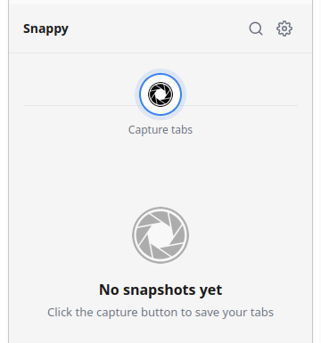
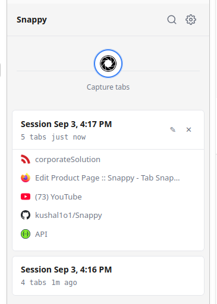
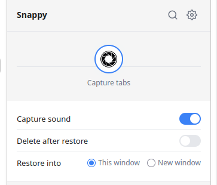

<p align="center">
  
</p>

<h1 align="center">Snappy</h1>

<p align="center">
  Capture and restore browser tab snapshots.
</p>

## Install

The extension needs a file called `manifest.json` to load. We have two versions:

| File | Browser |
|------|---------|
| `manifest-chrome.json` | Chrome, Edge, Brave, Chromium |
| `manifest-firefox.json` | Firefox |

### Step 1: Copy the right manifest

**Chrome / Edge / Brave / Chromium:**
```bash
cp manifest-chrome.json manifest.json
```

**Firefox:**
```bash
cp manifest-firefox.json manifest.json
```

### Step 2: Load the extension

**Chrome / Edge / Brave / Chromium:**
1. Open `chrome://extensions`
2. Enable **Developer mode**
3. Click **Load unpacked**
4. Select the `Snappy` folder

**Firefox:**
1. Open `about:debugging#/runtime/this-firefox`
2. Click **Load Temporary Add-on**
3. Select `manifest.json` from the `Snappy` folder
4. Open via View > Sidebar > Snappy

## Usage

- Click the **capture button** (centered on border) to save current tabs
- Click a **snapshot card** to expand and preview tabs
- Click **restore** (play icon) to reopen tabs
- Click **settings** (gear icon) to configure restore behavior
- **Search** icon to filter snapshots
- Remove individual tabs with the X in expanded view

## Demo

<p align="center">
  
  &nbsp;&nbsp;&nbsp;&nbsp;
  
  &nbsp;&nbsp;&nbsp;&nbsp;
  
</p>

## License

[MIT](LICENSE)